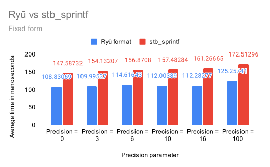

# Ryū

Jai implementation of [Ryū: Fast float to string conversion and Ryū printf](https://github.com/ulfjack/ryu). The following algorithms were ported:
* `f2s` -> `f32_to_shortest`
* `d2s` -> `f64_to_shortest`
* `d2fixed` -> `f64_to_fixed`
* `d2exp` -> `f64_to_exp`
* `s2f` -> `string_to_f32`
* `s2d` -> `string_to_f64`

The `f64_to_fixed` and `f64_to_exp` functions have additional return values, indicating whether the floating point value was negative, whether it was infinity or nan, the integral, fractional, and exponent part of the result, as well as the exponent's sign. This information can be useful to implement additional formatting to the final value, as implemented in `format.jai`.

# Dependencies
By default, Ryu does not import anything, so this is a standalone module. If `DEBUG` is specified in the module parameters, `Basic` is imported for printing.

# Module parameters
* `USE_64BIT_INSTRUCTIONS`: Use x86_64 asm instructions (using #asm blocks), mainly used in umul128 for double precision. There shouldn't be any reason to set this to false, since Jai only supports x64 so this should always be available, and faster. Set to true by default.
* `OPTIMIZE_SIZE`: Use small tables instead of full tables for d2s. Not entirely supported since d2s only implements it partially. If you want small tables then don't import string to float. Small tables removes about 5 KB to the final executable. Set to false by default.
* `IMPORT_FLOAT_TO_SHORTEST`: Import the f2s and d2s algorithms. Set to true by default.
* `IMPORT_FLOAT_TO_FIXED_AND_EXP`: Import the Ryū printf d2fixed and d2exp algorithms. Set to true by default.
* `IMPORT_STRING_TO_FLOAT`: Import the Ryū string to float algorithms.
* `DEBUG`: Print debugging information. Set to false by default.

# Performance comparison between Ryū and stb_sprintf, lower is better
Compiled using the LLVM backend in release mode (options -llvm -release). Executed 1000 times for 10000 random values. We compare against stb_sprintf as it is the library that is used by the default modules.

## Fixed form:

## Exponent form:


Note that the Jai compiler is still in closed beta as of now, and our implementation of Ryu will get faster in the future as the compiler produces faster output. Also, this was compared against stb_sprintf compiled from the original C source code using `cl /O2 /Oi`.  
Note that you most likely will never use Ryu with a precision of more than 16 digits (in exponent form), because 17 digits is enough to uniquely identify a f64, and when printing floating point values, you want them to be readable and/or parsable, and `string_to_f64` only works for up to 17 total non zero digits in the mantissa. This means that performance comparisons for higher precisions are mostly irrelevant. Consider this.

# Formatting options
The Jai port of Ryū has additional formatting options for the Ryū printf d2fixed and d2exp algorithms. There is an overload of `f64_to_fixed` and `f64_to_exp` that takes a `fmt : Format` as argument instead of a `precision : u32`. The format struct is defined as follows:

```jai
Format :: struct
{
	Flags :: enum_flags
	{
		FORCE_SIGN :: 0x01;
		ALIGN_SIGN :: 0x02;
		FORCE_SIGN_ON_EXPONENT :: 0x04;
		UPPERCASE  :: 0x08;
		REMOVE_TRAILING_ZEROES :: 0x10;
	}

	flags : Flags;
	min_width : u32;
	precision : u32;
	decimal_separator : u8 = #char ".";
	nan_string := "NaN";
	inf_string := "Inf";
}
```
## Flags:
* `FORCE_SIGN`: print a + in front of positive values,
* `ALIGN_SIGN`: print a space in front of positive values,
* `FORCE_SIGN_ON_EXPONENT`: print a + in front of positive exponent values,
* `UPPERCASE`: print E instead of e for exponent,
* `REMOVE_TRAILING_ZEROES`: remove trailing zeroes in the fractional part. If the fractional part is all zeroes, the decimal point is not printed.

`min_width` is the minimum number of digits to be printed. If the result is not infinity or nan, it is padded with zeroes between the sign and the integral part to fill the width. If it is infinity or nan, it is padded with spaces before the sign.  
`precision` is the number of digits to be printed after the decimal point.  
`decimal_separator` is the character to be printed for the decimal point. Default is '.'.  
`nan_string` is the string to be printed when the value is not a number. Default is 'NaN'.  
`inf_string` is the string to be printed when the value is +/- infinity. Default is 'Inf'.
